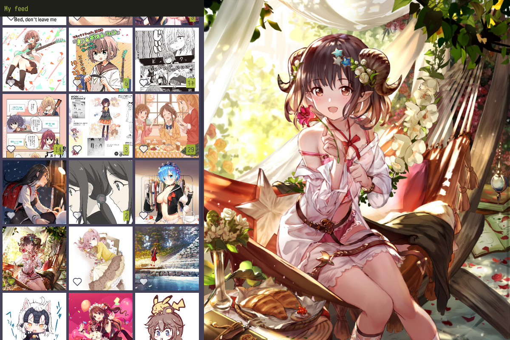

# rkgk
A typed Pixiv browser.




## Compiling and running
As this project is not really done yet, this is a bit cumbersome. In the future, a handy precompiled binary will be provided instead.
Compiling requires either npm or yarn, and `make`.

```
$ yarn install
$ make
```

Running requires `config.ru` from [rkgk-elm](https://github.com/steinuil/rkgk-elm).

```
$ bundle install
$ rackup
```

Then open `index.html` with your browser.


## Related projects
Because having alternatives is always good.

* [PixivDeck](https://github.com/akameco/PixivDeck) - desktop client using Electron, very similar to rkgk (except it's actually finished). It has a TweetDeck-like UI, which I don't care much for. Uses [pixiv-app-api](https://github.com/akameco/pixiv-app-api) as API wrapper.
* [PxView](https://github.com/alphasp/pxview) - mobile client using React Native. Uses [pixiv-api-client](https://github.com/alphasp/pixiv-api-client) as API wrapper.
* [PyPixiv](https://github.com/Yukariin/PyPixiv) - Python API wrapper for the Pixiv API, supersedes PixivPy which hasn't been updated in a few months now.
